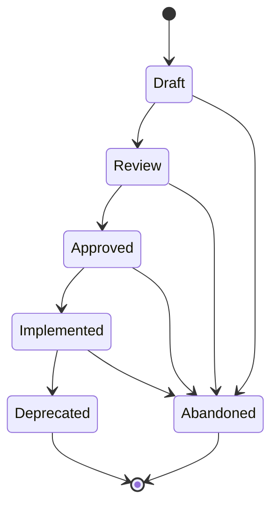

# Agent Specs (SPEC-NNN)

**Template:** [spec-template.md.j2](spec-template.md.j2)

Follow **spec-driven development** principles: an Agent Spec is a behavior contract — precise enough for an agent to create an implementation plan from, but concise enough to scan in a single pass. It defines external behavior (inputs, outputs, preconditions, constraints), not exhaustive requirements. Supplemental detail comes from child Stories and linked research.

- Should be scoped to something a team (or agent) can ship and validate independently.
