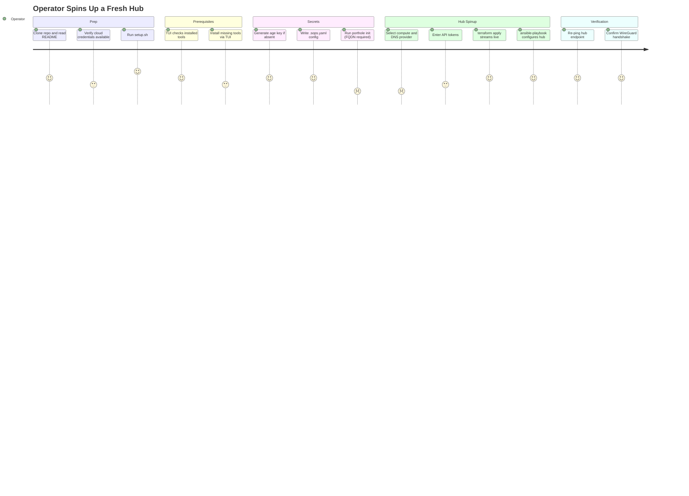

# JOURNEY-001: Operator Spins Up a Fresh Hub

## Persona

The **Operator** — a technically capable person who manages their own machines and
provides remote support to family. They understand basic Linux, cloud VMs, and
command-line tools. They are setting up Porthole for the first time (or rebuilding
a lost hub). They have a cloud account (Hetzner or DigitalOcean) and an existing
DNS domain.

## Goal

Get a working Porthole hub running on a fresh VPS — with WireGuard, CoreDNS,
nftables, and Guacamole all live — so that the fleet can start enrolling nodes.

## Steps / Stages

### Stage 1: Prep

The operator clones the repo on their workstation and reads the README. They verify
they have the necessary credentials: a cloud API token and a domain (or subdomain)
they control.

They run `./setup.sh`, which ensures `uv` is installed and launches the Textual TUI.

> **PP-01:** The operator must decide which compute provider and DNS provider to use,
> and whether those two choices can be mixed independently (e.g., Hetzner for compute
> + Cloudflare for DNS). The README and TUI are the only guidance — there is no
> pre-flight checklist that verifies which tokens they will need before they start.

### Stage 2: Prerequisites

The TUI opens to the **Prerequisites** screen. It checks for: `uv`, `wireguard-tools`,
`sops`, `age`, `porthole` (the CLI), `terraform`, and `ansible-playbook`.

Missing tools show with a red ✗ and an **Install** button. The operator clicks
Install for each missing tool. Each install runs asynchronously and streams output.
When all tools are present, the **Continue** button activates.

The operator proceeds to Secrets.

### Stage 3: Secrets

The TUI checks for three preconditions:

1. **Age key** at `~/.config/sops/age/keys.txt` — if absent, the operator clicks
   **Generate key** to create one.
2. **`.sops.yaml`** in the working directory — if absent, the operator clicks
   **Write .sops.yaml** to create the SOPS config pointing at their age public key.
3. **`network.sops.yaml`** — if absent, the TUI suspends and runs `porthole init`
   interactively. The operator provides the hub's eventual FQDN
   (e.g., `hub.example.com:51820`) and the age public key.

After initialization, the TUI shows a summary of the network state: subnet, domain,
hub endpoint. The operator proceeds to Hub Check.

> **PP-02:** `porthole init` requires the hub's FQDN as input, but the FQDN must
> exist in DNS before Terraform can run. The operator must decide (and possibly
> pre-create) a DNS name before they have a server IP — the ordering is awkward for
> first-time operators.

### Stage 4: Hub Spinup

The Hub Check screen pings the hub endpoint. Because the hub doesn't exist yet, it
shows **Unreachable**. The operator clicks **Spin Up Hub**.

The **Hub Spinup** screen appears with fields pre-filled from environment variables
where available:

- **Cloud provider**: Hetzner or DigitalOcean
- **Hub hostname**: pre-filled from the FQDN stored in `network.sops.yaml`
- **Compute API token**: pre-filled from `HCLOUD_TOKEN` or `DO_TOKEN` if set
- **DNS provider**: None / Cloudflare / DigitalOcean / Hetzner DNS
- **DNS token**: pre-filled from `CLOUDFLARE_API_TOKEN` / `DO_TOKEN` / etc.

The operator fills in any missing fields and clicks **Apply**.

The TUI runs in sequence:
1. `terraform init` (in the appropriate `terraform-hetzner/` or `terraform/` dir)
2. `terraform apply -auto-approve -var hub_hostname=... -var ...`
3. `terraform output -raw hub_ip` → captures the new IP
4. `ansible-playbook ansible/site.yml -e hub_ip=<IP>`

All output streams live into the TUI's RichLog widget. A progress indicator
tracks the four steps.

On success, the TUI pops back to Hub Check.

> **PP-03:** Terraform `apply` changes the real hub hostname DNS record to the new
> IP, but `network.sops.yaml` still stores the old FQDN (which is fine if DNS
> resolves, but the operator has no confirmation of this). There is no step that
> calls `porthole sync` to push the freshly-rendered configs to the new hub before
> proceeding. Ansible renders configs from the SOPS state but `porthole sync`
> is still needed to reconcile after any state changes.

### Stage 5: Verification

The Hub Check screen re-pings the hub. If DNS has propagated, the endpoint shows
as **Reachable** and the WireGuard handshake check shows green.

The operator can now proceed to enroll nodes (JOURNEY-002).

## Pain Points

### PP-01 — No pre-flight token checklist
> **PP-01:** The operator must choose compute+DNS provider combination and have the
> right tokens ready, but there is no pre-flight step that lists which tokens will
> be required before the spinup form is shown. First-time operators must read the
> README carefully or will hit an error mid-apply.

### PP-02 — FQDN required before server exists
> **PP-02:** `porthole init` requires the hub's FQDN as input, but the FQDN must
> exist or be pre-planned before Terraform can create the server. First-time operators
> have a chicken-and-egg moment: they need to know what DNS name they'll use before
> the server exists.

### PP-03 — No porthole sync step after hub spinup
> **PP-03:** After Terraform + Ansible complete, the TUI returns to Hub Check but
> does not run `porthole sync`. If the network state has any peers already registered,
> their configs won't be on the new hub until sync runs. The operator must know to
> run this manually.

### Pain Points Summary

| ID | Pain Point | Score | Stage | Root Cause | Opportunity |
|----|------------|-------|-------|------------|-------------|
| JOURNEY-001.PP-01 | No pre-flight token checklist before spinup form | 2 | Hub Spinup | TUI collects provider choice and tokens in the same form, no preview of what's needed | Add a "what you'll need" summary screen before the spinup form |
| JOURNEY-001.PP-02 | FQDN required before server exists (chicken-and-egg) | 2 | Secrets | `porthole init` takes endpoint as input but hub IP isn't known yet | Allow `porthole init` with a placeholder FQDN; let TUI update endpoint after `terraform output` |
| JOURNEY-001.PP-03 | No automatic `porthole sync` after hub rebuild | 2 | Verification | TUI only runs Terraform + Ansible; porthole sync is a separate CLI step | TUI should offer to run `porthole sync` after Ansible completes |

## Opportunities

1. **Pre-flight token guide**: Before showing the spinup form, display a summary of
   which tokens are needed for the chosen provider combination.
2. **Endpoint update after apply**: After `terraform output hub_ip`, have the TUI
   offer to update the hub endpoint in `network.sops.yaml` if the IP changed.
3. **Post-spinup sync prompt**: After Ansible succeeds, prompt the operator to run
   `porthole sync` to push peer configs to the new hub.

## Lifecycle

| Phase | Date | Commit | Notes |
|-------|------|--------|-------|
| Draft | 2026-03-04 | 031aaaa | Initial creation — first-time hub spinup via TUI |
