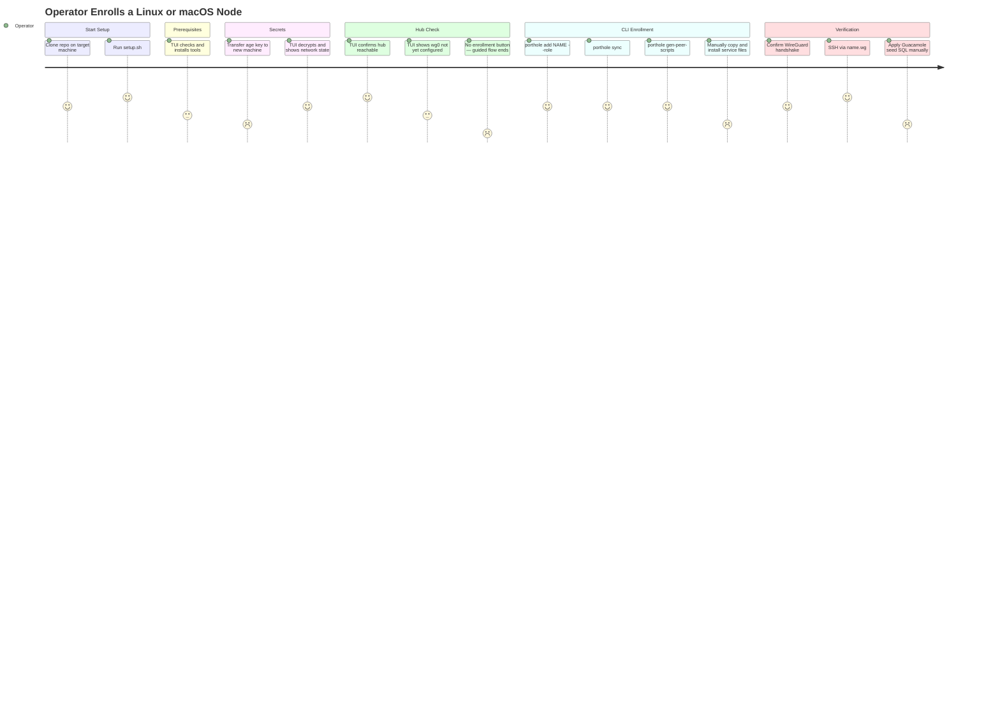

# JOURNEY-002: Operator Enrolls a Linux or macOS Node

## Persona

The **Operator** — enrolling a Linux Mint workstation or macOS laptop into the
Porthole fleet. The hub is already running (JOURNEY-001 is complete). The operator
has the repo checked out on the machine being enrolled (or will clone it).

## Goal

Add a new machine to the fleet so that it is reachable via `<name>.wg` SSH and
(for workstations) Guacamole remote desktop, with background daemons maintaining
the connection automatically.

## Steps / Stages

### Stage 1: Start Setup

The operator clones the repo (or `git pull` if already present) on the target
machine. They run `./setup.sh`.

The bash shim checks for `uv` and launches the Textual TUI (`porthole_setup`).

### Stage 2: Prerequisites

The TUI's **Prerequisites** screen checks for all required tools. On a fresh Linux
Mint machine, WireGuard tools, sops, age, and porthole may be missing.

The operator clicks **Install** for each missing tool. Install commands are run
via `apt-get` (Linux Mint) or `brew` (macOS). All tool checks pass and the operator
continues.

### Stage 3: Secrets

The **Secrets** screen checks for age key, `.sops.yaml`, and `network.sops.yaml`.
Because the hub is already initialized, `network.sops.yaml` exists in the repo
with at least the hub peer defined.

The operator's age key must be present at `~/.config/sops/age/keys.txt`. On a new
machine this key is absent.

> **PP-01:** The operator must transfer their age private key to the new machine
> before SOPS can decrypt `network.sops.yaml`. The TUI shows a failure state but
> does not guide the operator through the transfer. The operator must know to
> `scp` or otherwise copy the key file to the correct path manually.

After the key is present, the TUI decrypts and displays the network summary.

### Stage 4: Hub Check

The **Hub Check** screen pings the hub endpoint and checks the local `wg0`
interface. The hub is reachable. Because `wg0` is not yet configured on this
machine, the WireGuard check shows **Not connected**.

The operator proceeds without spinning up a hub (it's already running). The TUI
indicates the node is not yet enrolled.

> **PP-02:** The Hub Check screen offers buttons for **Spin Up Hub**, **Skip**,
> **Re-check**, and **Back** — but no **Enroll This Node** button. The TUI's
> guided flow ends here. The operator must exit the TUI and run CLI commands
> manually to complete enrollment.

### Stage 5: CLI-Based Enrollment (manual gap)

The operator exits the TUI and runs the following sequence from the repo root,
referring to the README:

```bash
# 1. Register the peer in network state
porthole add <name> --role workstation   # or --role server

# 2. Push updated configs to hub
porthole sync

# 3. Generate local service files
porthole gen-peer-scripts <name> --out ./peer-scripts/<name>

# 4. Apply local WireGuard config
sudo cp peer-scripts/<name>/wg0.conf /etc/wireguard/wg0.conf
sudo systemctl enable --now wg-quick@wg0

# 5. Install watchdog and reverse-tunnel services
sudo cp peer-scripts/<name>/wg-watchdog.sh /usr/local/bin/
sudo cp peer-scripts/<name>/wg-watchdog.service /etc/systemd/system/
sudo cp peer-scripts/<name>/wg-watchdog.timer /etc/systemd/system/
sudo cp peer-scripts/<name>/ssh-tunnel.service /etc/systemd/system/
sudo systemctl daemon-reload
sudo systemctl enable --now wg-watchdog.timer ssh-tunnel.service

# 6. Install status web server
sudo cp peer-scripts/<name>/wg-status-server.py /usr/local/bin/
sudo cp peer-scripts/<name>/wg-status-server.service /etc/systemd/system/
sudo systemctl enable --now wg-status-server.service
```

For macOS, equivalent commands use `launchctl load` with the generated `.plist`
files in `/Library/LaunchDaemons/`.

> **PP-03:** The number of manual steps is high. File copy paths, `systemctl`
> commands, and the ordering of operations are not documented in a single place.
> The README has a conceptual command reference but no step-by-step enrollment
> runbook. An operator who has not done this before will likely make mistakes
> or miss a step.

> **PP-04:** `porthole gen-peer-scripts` generates files but does not install them.
> There is no `porthole install-peer <name>` command that would automate the copy
> and service-enable steps. The operator must handle this themselves.

### Stage 6: Verification

The operator verifies enrollment:

```bash
porthole status        # Check handshake on hub
ping hub.wg            # DNS resolution via CoreDNS
ssh hub.wg             # SSH via mesh
```

For workstations, the operator seeds Guacamole:

```bash
porthole seed-guac     # Generate SQL insert
```

Then manually applies it to the Guacamole database (another undocumented step).

> **PP-05:** `porthole seed-guac` generates SQL but does not apply it. The operator
> must connect to the Guacamole PostgreSQL container and run the SQL manually. The
> README does not explain how to do this. Additionally, the Guacamole admin password
> starts as the default `guacadmin/guacadmin` — the operator must change it manually
> before the gateway is usable.



## Pain Points

### PP-01 — Age key transfer not guided
> **PP-01:** On a new machine the age private key is absent. The TUI shows a failure
> state but does not offer any guidance on how to transfer the key. The operator must
> know the correct path and transfer mechanism themselves.

### PP-02 — TUI guided flow ends at Hub Check (no enrollment screen)
> **PP-02:** After the hub check passes, the TUI has no screen to guide the operator
> through node enrollment. The buttons available (Spin Up Hub, Skip, Re-check, Back)
> are all oriented toward hub-not-found recovery, not toward the common case where the
> hub is running and this node needs to be added to it.

### PP-03 — No enrollment runbook
> **PP-03:** The manual enrollment sequence (porthole add → sync → gen-peer-scripts →
> copy files → enable services) spans 6+ commands with platform-specific variants for
> Linux and macOS. This is not documented as a step-by-step runbook in the repo.

### PP-04 — No `porthole install-peer` command
> **PP-04:** `porthole gen-peer-scripts` stops at file generation. There is no command
> to install the generated files into system directories and enable services. Operators
> must handle platform-specific file placement and service management manually.

### PP-05 — Guacamole seed not applied automatically; default credentials not changed
> **PP-05:** `porthole seed-guac` generates SQL but does not apply it. The operator
> must manually access the Guacamole PostgreSQL container. Additionally, the default
> Guacamole admin credentials (`guacadmin/guacadmin`) are not changed by any
> automated step, leaving the gateway insecure after deployment.

### Pain Points Summary

| ID | Pain Point | Score | Stage | Root Cause | Opportunity |
|----|------------|-------|-------|------------|-------------|
| JOURNEY-002.PP-01 | Age key transfer not guided by TUI | 2 | Secrets | TUI checks for key presence but has no transfer assistant | Add key-transfer helper screen (scp command, or QR code for local network) |
| JOURNEY-002.PP-02 | TUI ends at Hub Check — no node enrollment screen | 1 | Hub Check | SPEC-009 (Node Bootstrap TUI) is still Draft; enrollment flow not yet designed | Add a Step 4: Node Enrollment screen to the TUI (porthole add + sync + gen-peer-scripts + install) |
| JOURNEY-002.PP-03 | No step-by-step enrollment runbook | 2 | CLI Enrollment | README has conceptual command reference, not an operator runbook | Create RUNBOOK-001: Linux/macOS Node Enrollment |
| JOURNEY-002.PP-04 | No `porthole install-peer` command | 2 | CLI Enrollment | gen-peer-scripts generates but does not install | Add `porthole install-peer <name>` command that copies files and enables services |
| JOURNEY-002.PP-05 | Guacamole seed not applied; default admin password unchanged | 2 | Verification | seed-guac is a codegen step; no Guacamole admin bootstrap procedure exists | Document Guacamole first-run setup; optionally automate seed application |

## Opportunities

1. **TUI enrollment screen**: Add a Step 4 (Node Enrollment) to the TUI that runs
   `porthole add`, `porthole sync`, `porthole gen-peer-scripts`, and then invokes
   `porthole install-peer` or equivalent to copy and enable service files. This is
   the highest-value gap in the current TUI.
2. **`porthole install-peer` command**: Automate the copy-and-enable sequence for
   Linux (systemd) and macOS (LaunchDaemon). Detect platform automatically.
3. **Age key transfer screen**: In Secrets, when the key is missing and the hub is
   already initialized, show an `scp` or `rsync` command the operator can run from
   another enrolled machine.
4. **Guacamole first-run runbook**: Document how to apply the seed SQL and change
   the admin password, or automate both steps in Ansible.

## Lifecycle

| Phase | Date | Commit | Notes |
|-------|------|--------|-------|
| Draft | 2026-03-04 | fb02218 | Initial creation — Linux/macOS node enrollment via TUI then CLI |
