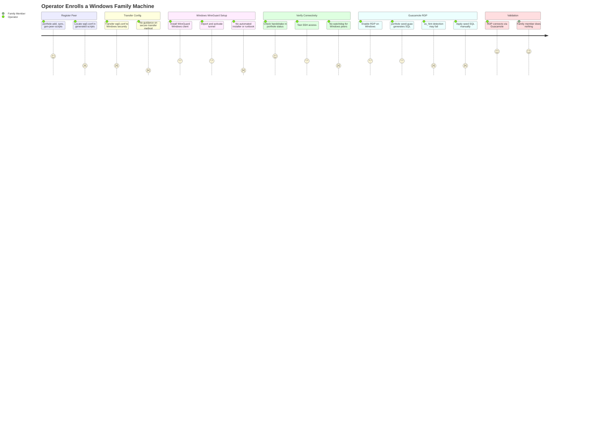

# JOURNEY-003: Operator Enrolls a Windows Family Machine

## Persona

The **Operator** — enrolling a Windows machine owned by a non-technical family
member. The hub is running. The operator performs all setup steps themselves, either
in person or via an existing remote session. The **Family Member** is passive
throughout: they do nothing during setup and nothing afterward. Their machine
must simply work.

## Goal

Add a family member's Windows PC to the fleet so that the operator can reach it
via Guacamole remote desktop (RDP) and SSH from any other node, without the family
member needing to understand or interact with any networking component.

## Steps / Stages

### Stage 1: Operator Registers the Peer

On the operator's enrolled machine (Linux or macOS), the operator runs:

```bash
porthole add <name> --role family
porthole sync
porthole gen-peer-scripts <name> --out ./peer-scripts/<name>
```

`porthole add` allocates a WireGuard IP and generates a keypair. `porthole sync`
pushes the updated hub config to the VPS. `porthole gen-peer-scripts` renders the
watchdog and reverse-tunnel scripts for this peer — but these are Linux/macOS
scripts; there is no Windows equivalent generated.

> **PP-01:** The `gen-peer-scripts` command generates bash scripts and systemd/plist
> service files. None of these are usable on Windows. The Windows peer needs only
> a WireGuard config file (`peer-wg0.conf`) — but there is no command that outputs
> just that file separately. The operator must know to look inside the generated
> directory for the `.conf` file.

### Stage 2: Transfer WireGuard Config to Windows

The operator opens the generated `peer-scripts/<name>/wg0.conf` file. It contains
the peer's private key (decrypted from SOPS), the hub's public key, and the allowed
IPs.

The operator must transfer this file to the Windows machine securely. Options vary:
USB drive, network share, secure messaging app, temporary scp session.

> **PP-02:** The `wg0.conf` file contains the peer's WireGuard private key in
> plaintext (it was decrypted from SOPS for this step). There is no guidance on how
> to transfer it securely to the Windows machine, and no step that deletes or
> re-encrypts the plaintext file after transfer. The operator must handle this
> themselves.

### Stage 3: Windows WireGuard Setup

On the Windows machine, the operator:

1. Downloads and installs the [WireGuard Windows client](https://www.wireguard.com/install/)
2. Opens the WireGuard UI → **Import tunnel(s) from file** → selects `wg0.conf`
3. Clicks **Activate** on the imported tunnel
4. Optionally enables **Launch WireGuard minimized** and **Start on startup**

There is no script, installer, or documented procedure for these steps in the repo.

> **PP-03:** Windows enrollment is entirely undocumented in the repo. VISION-001
> acknowledges that Windows provisioning automation is out of scope, but promises
> "documented manual setup procedures." No such runbook exists yet.

### Stage 4: Verify Connectivity

The operator, from their own enrolled machine, checks:

```bash
porthole status        # Verify handshake appears for the new peer
ping <name>.wg         # DNS resolution
ssh <name>.wg          # SSH access (requires Windows OpenSSH or SSH server)
```

WireGuard on Windows does not maintain an always-on connection the same way
systemd does — if the family member reboots, Windows may not reconnect automatically
unless the startup option is enabled.

> **PP-04:** There is no Windows watchdog equivalent. The Linux watchdog detects
> lost connectivity and restarts WireGuard. On Windows, if the tunnel drops (due
> to reboots, network changes, etc.), it will only reconnect automatically if the
> Windows WireGuard client is set to start on boot *and* Windows auto-connects the
> tunnel. The family member cannot be expected to manage this. No resilience
> mechanism exists for Windows peers.

### Stage 5: Enable RDP and Add to Guacamole

The operator enables Remote Desktop on the Windows machine:

- **Settings → System → Remote Desktop → Enable Remote Desktop**
- Sets a PIN or password the operator will use

On the operator's machine:

```bash
porthole seed-guac
```

This generates SQL that includes an RDP connection for the Windows peer (because
`os_hint == "windows"` logic in the template detects the word "windows" in the
peer name).

> **PP-05:** The os_hint detection in `guacamole-seed.sql.j2` looks for the string
> "windows" in the peer's name field (e.g., `peer.name | lower`), not a structured
> field. If the family machine is named "dad-pc" the template will generate an
> SSH-only connection even though it's a Windows machine. The Peer model has no
> `os_hint` or `platform` field.

The operator applies the seed SQL to Guacamole manually. (See JOURNEY-002.PP-05
for the undocumented procedure.)

### Stage 6: Validation

The operator opens Guacamole in a browser from their enrolled machine:

```
https://guac.<domain>
```

Clicks the Windows peer's RDP connection and verifies it connects to the desktop.
The family member's experience is now complete — they do nothing.



## Pain Points

### PP-01 — No command to output just the WireGuard peer config
> **PP-01:** `porthole gen-peer-scripts` generates a directory of Linux/macOS service
> files. The only artifact the Windows peer needs is `wg0.conf`, but it is buried
> inside the generated directory with no dedicated command to extract it. Windows
> operators must know to look there.

### PP-02 — No guidance on secure key transfer
> **PP-02:** `wg0.conf` contains the peer's WireGuard private key in plaintext after
> decryption. The repo provides no guidance on secure transfer to the Windows
> machine, and no cleanup step to remove or re-encrypt the plaintext file.

### PP-03 — No Windows enrollment runbook
> **PP-03:** VISION-001 commits to "documented manual setup procedures" for Windows,
> but no runbook exists in the repo. An operator enrolling a Windows machine must
> work from memory or search the WireGuard docs.

### PP-04 — No Windows watchdog equivalent
> **PP-04:** Linux/macOS nodes have a systemd/LaunchDaemon watchdog that reconnects
> WireGuard automatically. Windows nodes have no equivalent. A family member's
> machine may lose connectivity after a reboot or network change and require
> operator intervention to reconnect — violating R6 (family members passive after
> one-time setup).

### PP-05 — `os_hint` detected from peer name, not a structured field
> **PP-05:** The Guacamole seed template uses string matching on the peer name to
> decide whether to generate an RDP (Windows) vs. VNC (macOS) vs. xRDP (Linux)
> connection. The Peer model has no `platform` or `os_hint` field, making the
> detection fragile and undocumented.

### Pain Points Summary

| ID | Pain Point | Score | Stage | Root Cause | Opportunity |
|----|------------|-------|-------|------------|-------------|
| JOURNEY-003.PP-01 | No dedicated command to extract peer WireGuard config | 2 | Register Peer | gen-peer-scripts generates a full service bundle; Windows only needs wg0.conf | Add `porthole peer-config <name>` or `--config-only` flag to output just wg0.conf |
| JOURNEY-003.PP-02 | No guidance on securely transferring private key to Windows | 1 | Transfer Config | Plaintext wg0.conf contains WireGuard private key; no transfer guidance or cleanup | Document secure transfer options; optionally encrypt the .conf before handing it off |
| JOURNEY-003.PP-03 | No Windows enrollment runbook | 1 | Windows WireGuard Setup | VISION-001 promises manual docs; none created yet | Create RUNBOOK-002: Windows Family Machine Enrollment |
| JOURNEY-003.PP-04 | No Windows watchdog equivalent | 2 | Verify Connectivity | Service templates are Linux/macOS only; Windows WireGuard reconnect relies on client config | Document Windows reconnect behavior; consider a PowerShell watchdog or scheduled task |
| JOURNEY-003.PP-05 | os_hint detection is fragile name-matching, not a Peer model field | 2 | Guacamole RDP | Peer model lacks `platform` field; template infers OS from peer name string | Add `platform` field to Peer model; propagate through seed-guac template |

## Opportunities

1. **`porthole peer-config <name>`**: A dedicated command (or flag) that outputs only
   the decrypted `wg0.conf` for a named peer, with a clear warning about the private
   key and a recommendation to delete the file after transfer.
2. **Windows enrollment runbook**: A `docs/runbook/` artifact covering the full
   Windows manual setup: WireGuard install, tunnel import, startup config, RDP
   enablement, and validation steps.
3. **Windows watchdog via scheduled task**: A PowerShell script + Windows Task
   Scheduler configuration that checks WireGuard connectivity and reconnects if
   needed, generated alongside the `.conf` file.
4. **`platform` field in Peer model**: A structured field (values: `linux`, `macos`,
   `windows`) on the Peer dataclass, propagated to `seed-guac` for reliable OS-based
   connection type selection.

## Lifecycle

| Phase | Date | Commit | Notes |
|-------|------|--------|-------|
| Draft | 2026-03-04 | fb02218 | Initial creation — Windows family machine enrollment |
