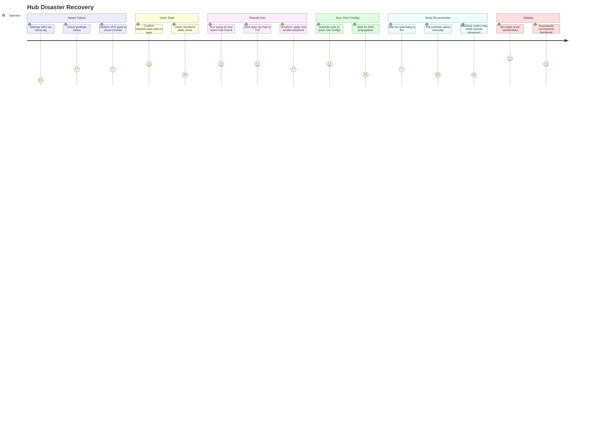

# JOURNEY-004: Hub Disaster Recovery

## Persona

The **Operator** — discovering that the Porthole hub VPS is gone (terminated,
crashed, or otherwise lost). All fleet nodes have lost connectivity to each other.
The operator needs to restore the hub from repo state with no manual re-enrollment
of any node.

## Goal

Rebuild the Porthole hub from scratch, using only the repo and cloud credentials,
so that all enrolled nodes reconnect automatically with no changes on any node.

## Steps / Stages

### Stage 1: Detect the Failure

The operator notices that SSH to any node via `<name>.wg` fails, or sees that
`porthole status` returns no handshakes. They attempt to ping the hub endpoint
directly and get no response.

They check their cloud console and confirm the hub VPS no longer exists (or is
in an error state).

### Stage 2: Verify State Is Intact

Before rebuilding, the operator confirms that `network.sops.yaml` is present and
current in the repo. This file is the single source of truth for all peer keys and
the hub's WireGuard config.

```bash
git log --oneline -5                    # Confirm recent commits
git show HEAD:network.sops.yaml | head  # Confirm file is present (encrypted)
sops -d network.sops.yaml | head        # Confirm it decrypts
```

The hub's WireGuard private key is in this file (encrypted). The Terraform state
may or may not be intact depending on whether it was committed.

> **PP-01:** Terraform state (`terraform.tfstate`) is not committed to the repo
> by default (it's in `.gitignore`). If the operator is working from a fresh clone
> on a new machine (e.g., the original workstation is also unavailable), the
> Terraform state is lost. `terraform apply` will create a new server but may not
> clean up any orphaned DNS records from the old one. The operator must handle
> this manually.

### Stage 3: Rebuild the Hub

The operator runs `./setup.sh` on any enrolled (or new) machine that has the repo.
The TUI's Secrets screen confirms state is intact. The Hub Check screen shows the
hub as unreachable.

The operator clicks **Spin Up Hub** and runs Terraform + Ansible again, following
the same steps as JOURNEY-001 Stage 4.

If the hub's FQDN resolves to a new IP after Terraform, DNS must propagate before
node peers can reconnect. The operator waits or can check with `dig`.

### Stage 4: Sync Peer Configs

After Ansible completes, the hub has the WireGuard config rendered from the
`network.sops.yaml` state. However, all existing peer configs still point to the
previous hub endpoint.

> **PP-02:** After rebuild, the hub IP may have changed (Terraform creates a new
> server with a new IP). The peer WireGuard configs on each enrolled node contain
> `Endpoint = hub.example.com:51820`. If DNS is updated, the nodes' watchdog scripts
> will re-resolve the hostname and reconnect — but only if the WireGuard service
> is already running on the node. The watchdog checks the endpoint every 60 seconds
> via the systemd timer.

The operator runs:

```bash
porthole sync        # Push updated hub wg0.conf and peer configs to hub
porthole seed-guac   # Re-apply Guacamole connections if needed
```

`porthole sync` is idempotent — it renders and uploads configs from the current
state. If node private keys are unchanged (they are, since they're in
`network.sops.yaml`), no re-enrollment of nodes is required.

### Stage 5: Wait for Node Reconnection

Enrolled Linux/macOS nodes run a watchdog every 60 seconds. The watchdog:
1. Re-resolves the hub hostname to check for IP changes
2. Updates the WireGuard endpoint if the IP changed
3. Pings the hub's WireGuard IP; after 3 failures, restarts WireGuard

Once DNS propagates and the watchdog fires, nodes should reconnect automatically.

> **PP-03:** The reconnection window can be up to 3 minutes (3 watchdog cycles)
> plus DNS propagation time (typically 1–5 minutes for Cloudflare, up to 15 minutes
> for others). During this window, the operator cannot use `<name>.wg` hostnames.
> The watchdog does not have any mechanism to notify the operator when a node has
> reconnected. The operator must poll `porthole status` manually.

Windows nodes will only reconnect if:
- The WireGuard client is running (startup option enabled)
- The Windows machine is powered on and connected to the internet

Family machines have no watchdog, so they depend entirely on the WireGuard client's
built-in keepalive and reconnect behavior.

### Stage 6: Validate

The operator runs `porthole status` and verifies all expected peers show recent
handshakes. They SSH to a few nodes to confirm reachability.

Guacamole connections are already seeded from the previous `seed-guac` run, but
the operator should verify they still work by opening a few connections.

> **PP-04:** If the Guacamole PostgreSQL data was stored only in the Docker volume
> on the old hub (not re-seeded), all connections are lost. `porthole seed-guac`
> can regenerate them, but the Guacamole admin password change (if done after
> initial setup) is not stored anywhere in the repo — it must be done again.



## Pain Points

### PP-01 — Terraform state not committed
> **PP-01:** `terraform.tfstate` is gitignored and may be lost if the operator's
> workstation is also unavailable. Without it, Terraform treats the rebuild as a
> fresh create, which may leave orphaned resources (DNS records, firewall rules from
> the old server) in the cloud provider.

### PP-02 — No automatic porthole sync in TUI after hub rebuild
> **PP-02:** After Ansible completes, the TUI returns to Hub Check but does not run
> `porthole sync`. The hub has the configs Ansible rendered at deploy time, but if
> the operator has added peers since the last deploy, those peers won't be in the
> hub's WireGuard config until sync runs. (This is the same gap as JOURNEY-001.PP-03.)

### PP-03 — No reconnection notification; operator must poll
> **PP-03:** The watchdog reconnects nodes silently. The operator has no way to know
> when a node has reconnected without polling `porthole status`. During recovery,
> this creates uncertainty about whether the rebuild succeeded or whether nodes are
> still waiting.

### PP-04 — Guacamole admin password not persisted
> **PP-04:** The Guacamole PostgreSQL data lives in a Docker volume on the VPS.
> After a rebuild, the volume is gone. `porthole seed-guac` can restore connections,
> but the admin password change is not stored anywhere in the repo. The operator must
> reset the password again after every hub rebuild.

### Pain Points Summary

| ID | Pain Point | Score | Stage | Root Cause | Opportunity |
|----|------------|-------|-------|------------|-------------|
| JOURNEY-004.PP-01 | Terraform state not committed; lost on workstation failure | 2 | Verify State | .tfstate is gitignored by convention; not Porthole-specific but affects recovery | Document Terraform state backup options; consider Terraform Cloud state backend |
| JOURNEY-004.PP-02 | TUI does not run porthole sync after hub rebuild | 2 | Sync Peer Configs | TUI exits after Ansible; porthole sync is a separate manual step | Same as JOURNEY-001.PP-03: TUI should offer to run porthole sync post-deploy |
| JOURNEY-004.PP-03 | No reconnection notification; operator must poll | 2 | Node Reconnection | Watchdog reconnects silently; no event hook or notification | Watchdog could write a reconnect event to syslog; porthole status could flag stale peers prominently |
| JOURNEY-004.PP-04 | Guacamole admin password not persisted across hub rebuilds | 2 | Validate | Guacamole PostgreSQL volume is ephemeral; password change not in repo state | Store hashed admin password in network.sops.yaml; seed-guac applies it via SQL |

## Opportunities

1. **Terraform state remote backend**: Document how to configure Terraform Cloud or
   S3-compatible remote state so that `terraform.tfstate` survives workstation loss.
2. **Post-deploy sync**: After the TUI's hub spinup completes, automatically run
   `porthole sync` as the final step (see JOURNEY-001.PP-03 for the same gap).
3. **Watchdog syslog tagging**: Add a structured log entry when the watchdog
   successfully reconnects, enabling `porthole status` to surface "reconnected
   N minutes ago" alongside the handshake timestamp.
4. **Guacamole admin password in state**: Store a hashed Guacamole admin password
   in `network.sops.yaml` and have `seed-guac` (or an Ansible task) apply it on
   every hub deploy.
5. **Back up hub state:** use backrest+restic to maintain B2 backups of the hub and restore them on re-creation.

## Lifecycle

| Phase | Date | Commit | Notes |
|-------|------|--------|-------|
| Draft | 2026-03-04 | 031aaaa | Initial creation — hub VPS loss and rebuild from repo |
| Validated | 2026-03-06 | audit-fix | Remediation — transition was not recorded |
